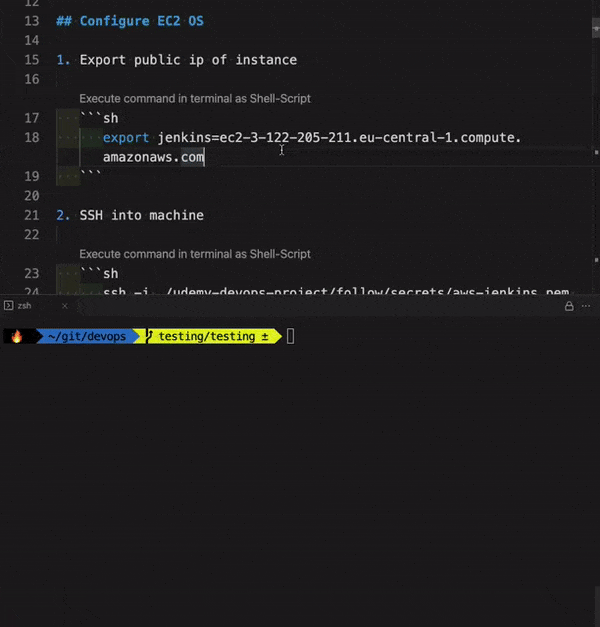
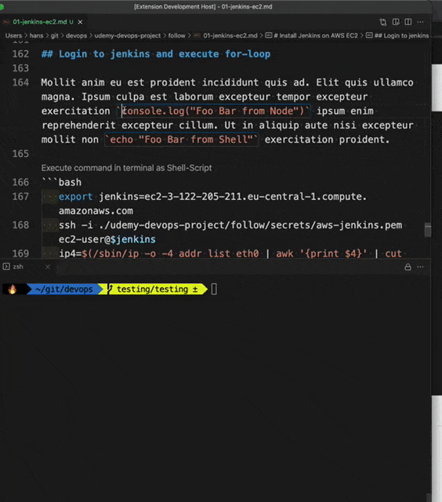
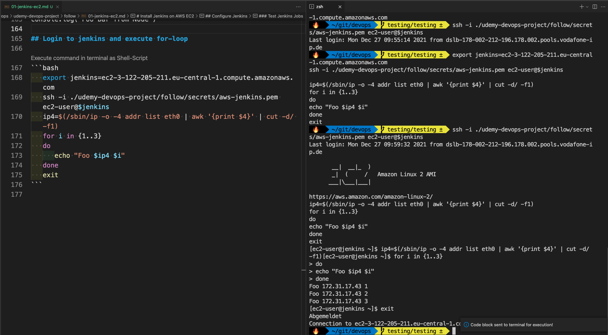

# makrdown-execute

Detects code blocks in your `markdown` files starting with **\`\`\`sh** and **\`\`\`bash** and and adds `'Execute command in terminal as Shell-Script'` or `'Execute command in terminal as NodeJs-Script'` label.

Clicking on the label executes code-block until the closing ticks **\`\`\`** in the terminal as `Shell` or `NodeJs` script.

Use `cmd+f1` (mac) / `ctrl+f1` (windows) shortcut to execute current selection as well.

## Features

### Execute code blocks in terminal

### Execute Selection

Select code and either use shortcut `cmd+f1` (mac) / `ctrl+f1` (windows) to execute or open the VSCode `command palette` and type `markdown execute` to find the command:

### Side By Side view

If you interact with terminal very often, I recomment using the terminal in editor area side by side in split view.:

## Extension Settings

This extension contributes the following settings:

- `markdown-execute.executeInSsh`: enable/disable execution of code in a SSH session. If disabled and active terminal is running a SSH session, a new terminal is used as target for commands.
- `markdown-execute.executeSelection`: Shortcut to execute selection. Defaults to `cmd+f1` (mac) / `ctrl+f1` (windows).

## Release Notes

### 0.0.1

Initial release of `markdown-execute`.

### 0.0.5

- Add keybinding to execute selection.
- Refactor code.
- Add proper documentation.

## Backlog

1. Add PHP & Python as execution runtimes:
   1. `commandCodeLensProvider`:
      1. Execute command with Python
      2. Execute command PHP
   2. `extension.ts` & `execute.ts`:
      1. Add PHP and Python as execution runtimes
2. Add quick select keybinding without promting:
   1. `cmd+f1 s` Execute command as Shell
   2. `cmd+f1 s` Execute command with Nodejs

## Appreciations

[Sycl´s Markdown Command Runner](https://marketplace.visualstudio.com/items?itemName=Sycl.markdown-command-runner) Extension served as inspiration. Thanks!

It was lacking execution of code blocks in active SSH sessions, shortcuts and `NodeJs`-support, so I made my own.
